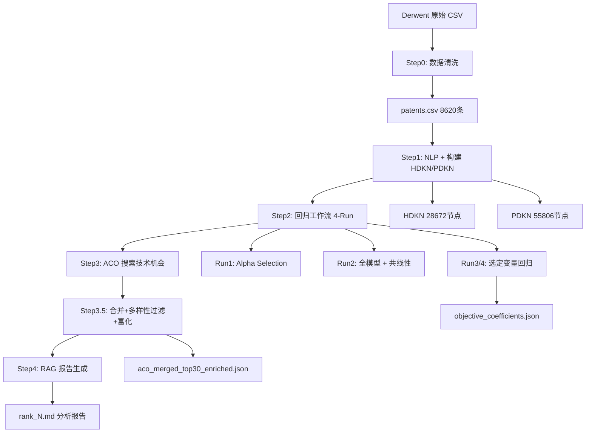

# 专利技术机会分析系统

> 基于专利数据的知识网络构建与技术机会发现系统
> 参考 Ren, H., & Zhao, Y. (2021) 的研究方法实现

[](https://www.python.org/)

## 项目简介

本项目实现了一个完整的专利分析流程，以具身智能（Embodied AI）领域为应用场景：

- **数据清洗**：从 Derwent Innovation 导出原始 CSV，进行年份过滤、语言核验、去重
- **NLP 处理**：专利文本的句法分析、依赖提取和补边机制
- **知识网络构建**：构建历史 DKN（HDKN）和预测期 DKN（PDKN）
- **特征提取**：7 种可配置子网特征（New_n、New_e、Min_pn、Con_n、Con_e、Eigen、Constraint）
- **回归分析**：NB + ZINB 双模型预测专利影响力，4-Run 工作流
- **ACO 搜索**：蚁群优化算法搜索高价值技术机会子网，带新颖度引导机制
- **候选合并**：多样性过滤 + 节点/边分类富化，生成结构化 JSON
- **RAG 报告**：调用 DeepSeek API，按原文方法论生成结构化技术机会分析报告

## 系统流程



## 快速开始

### 环境要求

- Python >= 3.8
- 8GB+ RAM（推荐）

### 安装

```bash
pip install -r requirements.txt
python -m spacy download en_core_web_sm
```

### 准备数据

将 Derwent Innovation 导出的原始 CSV 放在 `data/raw/` 下，然后执行数据清洗：

```bash
python scripts/step0_import_patents.py --raw-csv data/raw/csv2026-03-18-15-53-59.csv --min-year 2012
```

## 运行项目

### Step0：数据导入与清洗

```bash
python scripts/step0_import_patents.py
```

解析 Derwent 导出 CSV（44 列中文列头），映射到标准字段，进行年份过滤、多层语言核验（非拉丁字符检测、OCR 乱码过滤等）、去重，输出 `patents.csv` 和 `patents_excluded.csv`。

### Step1：构建知识网络

```bash
python scripts/step1_build_networks.py --hist-end-year 2022
```

对每篇专利进行 NLP 处理（分词、依存关系提取、连字符/复合词合并），合并为 HDKN（历史网络，≤2022）和 PDKN（全时段网络），通过时间衰减公式计算边权重。

### Step2：回归分析工作流（4-Run）

```bash
# Run 1: Alpha Selection — 选择最优衰减因子
python scripts/regression_workflow.py --run-id <ID> --run 1 --alphas "0.0,0.1,...,1.0"

# Run 2: 全模型 + 共线性检验
python scripts/regression_workflow.py --run-id <ID> --run 2

# Run 3: 选定变量 + 控制变量
python scripts/regression_workflow.py --run-id <ID> --run 3 --vars "New_e,Eigen,Constraint"

# Run 4: 仅选定变量 — 系数用于 ACO 目标函数
python scripts/regression_workflow.py --run-id <ID> --run 4 --vars "New_e,Eigen,Constraint"

# Combined: 合并 Run 2/3/4 对比表
python scripts/regression_workflow.py --run-id <ID> --run combined --vars "New_e,Eigen,Constraint"
```

以 HDKN 内专利为样本，被引次数为因变量，子网特征为自变量，通过 NB/ZINB 回归识别显著特征并提取系数（New_e=+2.17, Eigen=-170.99, Constraint=-111.86）。

### Step3：ACO 搜索

```bash
python scripts/step3_pdkn_aco.py --run-id <ID> --test-num-ants 500 --force
```

以回归系数构建目标函数 Z = 2.17×New_e − 171.0×Eigen − 111.9×Constraint，在 PDKN 上用蚁群优化搜索使 Z 最大化的 15 节点子网。

### Step3.5：候选合并 + 多样性过滤 + 子网富化

```bash
python scripts/merge_aco_candidates.py --run-id <ID> --top-n 30 --overlap 0.8
```

合并所有 ACO 运行的候选子网（960 条），去重 + 80% 节点重叠过滤，选出 Top-30 多样化子网。然后对每个子网进行富化：节点/边按 new/marginal/special/conventional 分类，匹配代表性专利，注入 Eigen 值和 is_marginal 标记。

### Step4：RAG 报告生成

```bash
export DEEPSEEK_API_KEY=your_api_key
.venv/bin/python scripts/step4_rag_report.py --run-id <ID>

# 仅生成指定 rank
.venv/bin/python scripts/step4_rag_report.py --run-id <ID> --rank 1 --force
```

将富化子网的结构数据（Z 值分解、★/◇ 节点标记、△/□ 边描述）和专利证据注入 LLM prompt，按原文方法论（分类→提取 novel combinations→推断技术含义→综合描述）生成四段式 Markdown 报告。

### 编排器（自动执行 Step1 → Step4）

```bash
python scripts/run_all.py --hist-end-year 2022
python scripts/run_all.py --limit 500  # 快速测试
```

## 产物目录结构

```
outputs/runs/<run_id>/
├── 01_networks/
│   ├── hdkn.pkl.gz                    # 历史知识网络
│   ├── pdkn.pkl.gz                    # 预测期知识网络
│   └── networks_meta.json
├── 02_regression/                      # 回归结果与工作流产物
│   ├── regression_features.csv
│   ├── run1_results.json              # Alpha Selection 结果
│   ├── run2_*.pkl / .json / .txt      # 全模型 + 共线性
│   ├── run3_*.pkl / .json / .txt      # 选定变量 + 控制
│   ├── run4_*.pkl / .json / .txt      # 仅选定变量
│   ├── objective_coefficients.json    # ACO 目标函数系数
│   └── reports/
├── 03_aco*/                            # 各配置 ACO 搜索结果
│   ├── aco_candidates.json
│   ├── aco_topk_enriched.json
│   ├── aco_meta.json
│   └── reports/
└── 04_rag_reports/                     # RAG 分析报告
    ├── rank1_*.md                     # 各 rank 的 Markdown 报告
    └── rag_meta.json                  # 报告生成元数据
```

## 项目结构

```
.
├── configs/
│   ├── aco_config.yaml              # ACO 算法配置（含新颖度引导参数）
│   ├── rag_config.yaml              # RAG 报告生成配置（模型/参数/证据上限）
│   └── features.yaml                # 回归特征选择配置
├── data/
│   ├── raw/
│   │   ├── csv2026-03-18-15-53-59.csv  # Derwent 原始导出
│   │   ├── patents.csv              # 清洗后数据
│   │   └── patents_excluded.csv     # 被排除记录
│   ├── processed/
│   │   └── rag/                     # Step3.5 产物
│   │       ├── aco_merged_top30_enriched.json   # 富化子网 JSON
│   │       ├── aco_merged_top30_candidates.json  # 精简候选列表
│   │       └── merge_summary.json               # 合并摘要
│   └── README.md
├── docs/
│   ├── methodology.md               # 变量定义、权重计算、特征说明、RAG 方法论
│   ├── field_mapping.md             # CSV 字段映射
│   └── nlp_notes.md                 # NLP 分词与停用词说明
├── outputs/                          # 运行时自动生成
├── scripts/
│   ├── step0_import_patents.py      # Step0: 数据导入与清洗
│   ├── step1_build_networks.py      # Step1: 构建 HDKN + PDKN
│   ├── step2_hdkn_regression.py     # Step2: 单步回归（简易版）
│   ├── regression_workflow.py       # Step2: 4-Run 回归工作流（推荐）
│   ├── step3_pdkn_aco.py            # Step3: ACO 搜索
│   ├── merge_aco_candidates.py      # Step3.5: 候选合并 + 富化
│   ├── step4_rag_report.py          # Step4: RAG 报告生成
│   ├── run_all.py                   # Pipeline 编排器
│   ├── alpha_selection.py           # 独立 α 选择
│   └── common.py                    # 脚本公共工具
├── src/patent_opportunity_analysis/ # 主包
│   ├── nlp_utils.py                 # NLP 处理
│   ├── patent_graph.py              # 专利图构建
│   ├── dkn_builder.py               # DKN 构建
│   ├── feature_extraction.py        # 特征提取
│   ├── feature_registry.py          # 特征注册与配置
│   ├── regression_model.py          # 回归模型
│   ├── aco_search.py                # ACO 搜索（含新颖度引导）
│   ├── aco_to_rag.py                # ACO 子网 → 富化 JSON
│   ├── rag_report_generator.py      # RAG 报告生成器
│   ├── rag_prompts.py               # LLM Prompt 模板
│   ├── rag_patents.py               # 专利证据检索
│   └── utils/
├── tests/
├── requirements.txt
├── setup.py
├── readme.md                         # 本文档
└── PROJECT_OVERVIEW.md               # 详尽版项目介绍
```

## 核心配置

### 特征配置（configs/features.yaml）

| 特征 | 含义 | 类型 |
|------|------|------|
| New_n | 子网是否包含新节点 | 新颖性 |
| New_e | 子网是否包含新边 | 新颖性 |
| Min_pn | 覆盖子网的最小专利数 | 新颖性 |
| Con_n | 节点 Strength 中位数 | 常规性 |
| Con_e | 边 Weight 中位数 | 常规性 |
| Eigen | 特征向量中心性平均值 | 结构 |
| Constraint | Burt 网络约束最小值 | 结构 |

### RAG 配置（configs/rag_config.yaml）

| 参数 | 默认值 | 说明 |
|------|--------|------|
| model_name | deepseek-chat | LLM 模型 |
| temperature | 0.1 | 生成温度 |
| top_n_edges | 10 | 边选取数量（分层配额） |
| top_k_patents | 15 | 最多提供的专利证据数 |
| evidence_max_chars | 60000 | 证据库字符串上限 |

## 常见问题

**Q: 运行很慢？**
A: 使用 `--limit` 减少数据量，或在 `aco_config.yaml` 中减少蚂蚁数量和迭代参数。

**Q: HDKN 和 PDKN 的区别？**
A: HDKN 为历史网络（app_year ≤ 2022），用于特征提取和回归训练；PDKN 为全时段网络，用于 ACO 搜索。

**Q: Step4 报错 ModuleNotFoundError: openai？**
A: 使用 `.venv/bin/python` 而非系统 `python` 来执行脚本。

**Q: Step4 报告中某类节点/边显示"不存在"？**
A: 这是正常的——并非每个子网都包含所有类型的节点和边。例如高 New_e 驱动的子网可能没有 marginal 节点。

## 参考文献

Ren, H., & Zhao, Y. (2021). Technology opportunity discovery based on constructing, evaluating, and searching knowledge networks. *Technovation*, *101*, 102196. [https://doi.org/10.1016/j.technovation.2020.102196](https://doi.org/10.1016/j.technovation.2020.102196)
